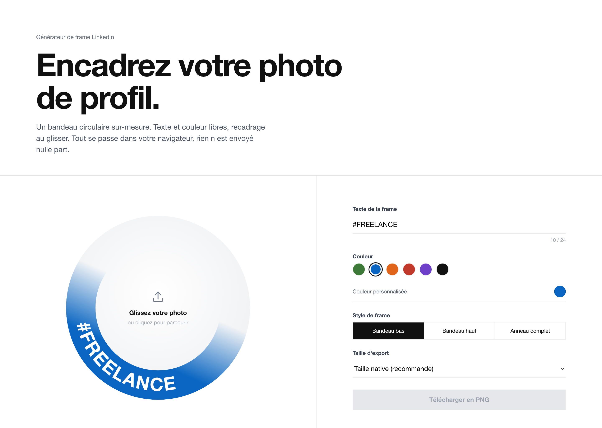

# LinkedIn Frame Generator

[](https://github.com/MarJC5/linkedin-frame/actions/workflows/deploy.yml)

Micro web app pour générer une frame custom (style `#FREELANCE`, `#OPENTOWORK`, `#HIRING`) sur une photo de profil LinkedIn.

**[Démo en ligne →](https://marjc5.github.io/linkedin-frame/)**



- **100% client-side** : aucune image n'est envoyée à un serveur, rien n'est conservé après rechargement.
- **Qualité native** : l'image originale est traitée à sa résolution native, la frame est vectorielle (SVG), l'export est un PNG non recompressé.
- **Anneau + bandeau dégradé** : un anneau complet dont le stroke est un dégradé directionnel qui crée le bandeau coloré localisé (le vrai rendu LinkedIn), pas un arc tronqué.
- **Texte + couleur libres** : champ texte, color picker, 6 presets, 3 styles de frame (bandeau bas, bandeau haut, anneau complet).
- **Upload intégré + recadrage** : on dépose ou clique directement sur l'aperçu pour charger une photo, puis on la glisse pour la recadrer dans le cercle.

## Stack

- Vite + React + TypeScript
- Vitest + @testing-library/react (TDD)

## Démarrage

```sh
npm install
npm test        # mode watch
npm run dev     # http://localhost:5173
npm run build   # bundle prod dans dist/
```

## Structure

```
src/
  App.tsx                    # layout éditorial, état global, modale RGPD
  index.css                  # reset + tokens (borders, couleurs, typo)
  components/
    Editor.tsx               # contrôles (texte, couleur, variant, taille export)
    ColorPicker.tsx          # presets + input color
    FramePreview.tsx         # aperçu : upload intégré, recadrage au glisser, FrameSVG superposé
    FrameSVG.tsx             # SVG paramétrique (anneau + dégradé + textPath)
  lib/
    frameVariants.ts         # définitions des anneaux et dégradés par variante
    loadImage.ts             # File → HTMLImageElement
    composeAndDownload.ts    # canvas → PNG download (avec recadrage)
```

## Soutenir

Si ce projet vous est utile, vous pouvez m'offrir un café :

<a href="https://www.buymeacoffee.com/misits"></a>
